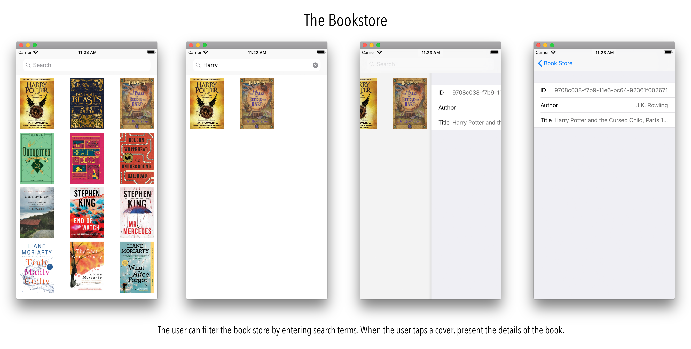

# Bookstore

A simple iOS bookstore application that allows you to display your book covers, along with 
some information about the book itself. To achieve this you will need to read the `books.json` file from a server (e.g. `localhost:8000/books.json`. Each book is represented by a JSON object in the array from the `books` key.

```json
{
  "id": "36e08952-f7be-11e6-bc64-92361f002671",
  "title": "Fantastic Beasts",
  "author": "J.K. Rowling"
}
```

There is 1 cover image for each book. This is denoted by the `identifier` of the book. So for the 
above example, the image can be found on the server at `http://localhost:8000/36e08952-f7be-11e6-bc64-92361f002671.jpg`.

### Server

You can use Python to start a simple web server to serve the files.

```
python3 -m http.server --directory /path/to/assignment/Bookstore-Server/
```

---



---
